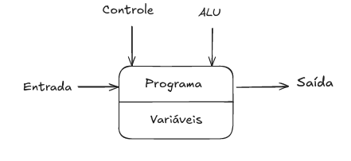

<h1 style="color:#1BB3FA;">Livros da matéria de LP</h1>

- Tucker Noonan, "Linguagens de Programação", 2010
-  Flávio Varegão, "Linguagens de Programação"
  
<h1 style="color:#1BB3FA;">AULA | Baseado em LTN10, CAPS 1.1-1.3</h1>

<h2 style="color:#1BB3FA;">Principios de projeto de linguagens</h2>

- `Sintaxe:` "Como é um programa correto na linguagem?" - Conjunto de regras para que o compilador consiga transformar o seu código em linguagem de máquina. | Descreve o que constitui um programa "correto".
- `Nomes e Tipos:`Regras para nomear entidades (tipos, função, classe, o que pode ser manipulado) e os valores que programas podem manipular.
- `Semântica:`Efeito de cada comando sobre os valores das variáveis.
- `Paradigma (de Programação):`uma espécie de modelo para cada linguagem de programação - Padrão de solução de problemas que se relaciona a um determinado gênero de progrmas de linguagens.
- `Imperativo`:
  


```Fortran
 program circle
 real R,area
 !Area do circulo
 read(*,*) R
 area = 3.14159 * R  * R
 write(*,*)'Area =',area
 stop
 end

```

- `Orienntada a Objetos:`

```java
public class Main{
   public static void main(String[] args){
      System.out.println("Olar");
   }
}

```

- `Funcional:`

```Haskell
 qsort::Ord a=>[a]->[a]
 qsort [] = []
 qsort(p:xs)=qsort[x|x<-xs,x<p]++p++qsort[x|x<-xs,x>=p]

```


- `Lógico:`

```Prolog
 woman(mia).
 woman(jody).
 woman(yoland).
 playsAirGuitar(jody).
 party.

 ? - playsAirGuitar(mia).
 ? - playsAirGuitar(jody).

```

